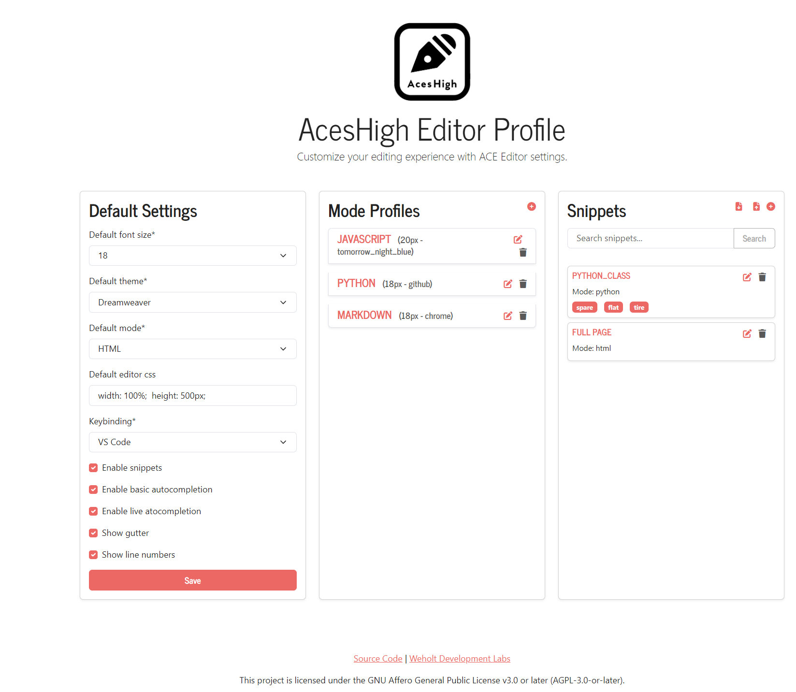
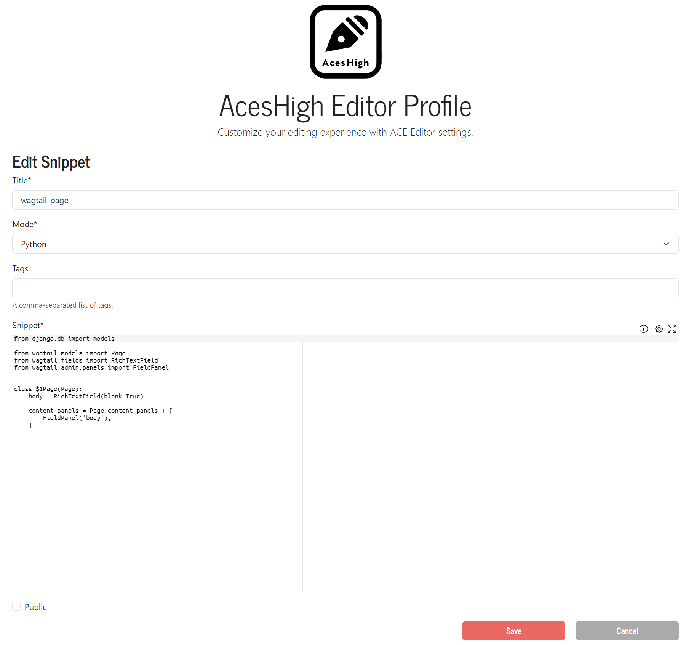
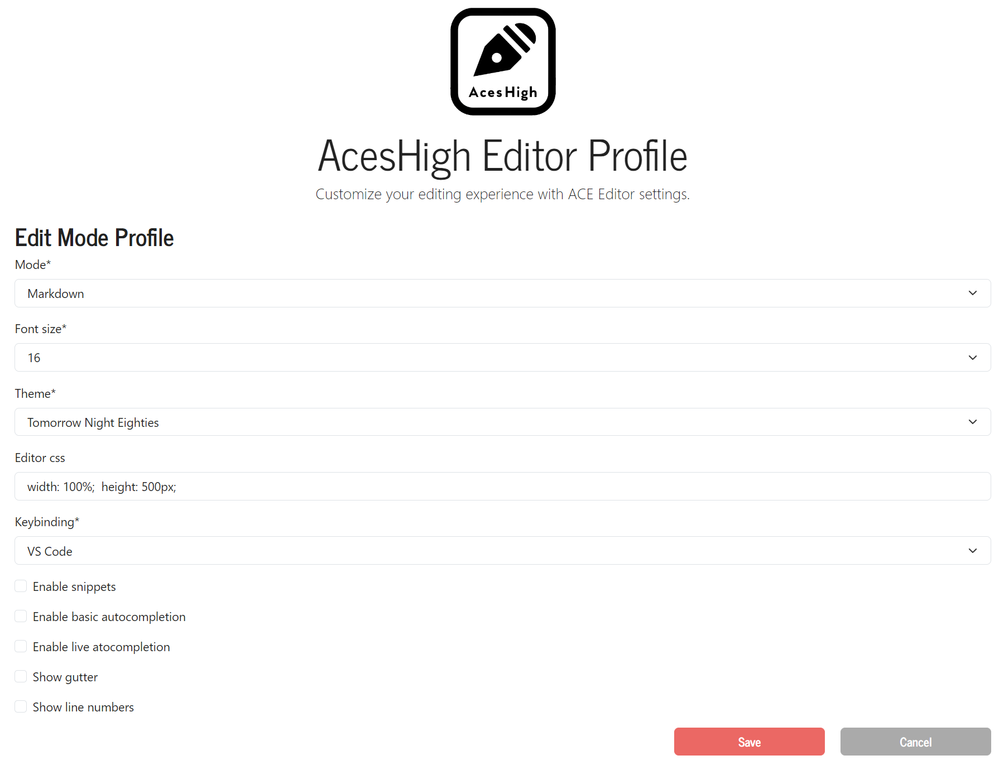

# AcesHigh


AcesHigh is a Django application designed to integrate the ACE editor into Django forms seamlessly.

## Features
- Customizable ACE editor settings
- Support for multiple ACE editor themes and modes
- Snippet management with tagging support
- Fullscreen editor toggle
- Snippet search and tag cloud visualization
- Public snippet sharing with an API

## Requirements
- Python 3.12+
- Django 5.0+
- django-crispy-forms
- django-crispy-bootstrap5
- django-taggit
- djangorestframework
- drf-yasg

## Screenshots


You can define default settings for ACE Editors, like font-size, theme & custom CSS.


You can define snippets with fancy autocomplete for faster coding.


You can specify specific theme, font-size and css per mode.

## Installation
1. Install the package:
    ```bash
    pip install aceshigh
    ```

2. Add `aceshigh` and its dependencies to your `INSTALLED_APPS` in `settings.py`:
    ```python
    INSTALLED_APPS = [
        ...
        'crispy_forms',
        'crispy_bootstrap5',
        'taggit',
        'rest_framework',
        'drf_yasg',
        'aceshigh',
    ]

    CRISPY_ALLOWED_TEMPLATE_PACKS = "bootstrap5"
    CRISPY_TEMPLATE_PACK = "bootstrap5"
    ```

3. Include the AcesHigh URLs in your `urls.py`:
    ```python
    from django.urls import include, path
    from drf_yasg.views import get_schema_view
    from drf_yasg import openapi
    from rest_framework import permissions

    schema_view = get_schema_view(
        openapi.Info(
            title="AcesHigh API",
            default_version='v1',
            description="API for accessing public snippets",
            contact=openapi.Contact(email="thomas@weholt.org"),
        ),
        public=True,
        permission_classes=(permissions.AllowAny,),
    )

    urlpatterns = [
        ...
        path('aceshigh/', include('aceshigh.urls')),
        path('api/', include('aceshigh.api_urls')),
        path('swagger/', schema_view.with_ui('swagger', cache_timeout=0), name='schema-swagger-ui'),
    ]
    ```

## Usage
- To add the ACE editor to any form, use the `` template tag in your templates.

## License
This project is licensed under the GNU Affero General Public License v3.0 or later (AGPL-3.0-or-later).

## Credits
- [ACE Editor](https://github.com/ajaxorg/ace)

## Usage Examples

### Example 1: Using the Custom Field in a Model

Define a model using the custom `AceEditorField`:

```python
# filename: models.py

from django.db import models
from .fields import AceEditorField

class YourModel(models.Model):
    content = AceEditorField()
```

### Example 2: Using the Custom Widget in a Form

Create a form using the custom widget:

```python
# filename: forms.py

from django import forms
from .models import YourModel

class YourModelForm(forms.ModelForm):
    class Meta:
        model = YourModel
        fields = '__all__'
```

### Example 3: Registering the Model in the Admin

Register the model in the admin to use the custom widget:

```python
# filename: admin.py

from django.contrib import admin
from .models import YourModel

class YourModelAdmin(admin.ModelAdmin):
    pass

admin.site.register(YourModel, YourModelAdmin)
```

### Example 4: Using the Custom Widget in a Template

Render the form in a template:

```html
<!-- filename: template.html -->

<!DOCTYPE html>
<html lang="en">
<head>
    <meta charset="UTF-8">
    <meta name="viewport" content="width=device-width, initial-scale=1.0">
    <title>Django Ace Editor with Crispy Forms</title>
    <style>
        .ace-editor {
            height: 200px;
            width: 100%;
            margin-bottom: 20px;
            position: relative;
        }
        .fullscreen-icon {
            position: absolute;
            top: 5px;
            right: 5px;
            cursor: pointer;
        }
    </style>
    
    
</head>
<body>
    <h1>My Form with Ace Editor</h1>
    <form method="post">
        
        {{ form|crispy }}
        <button type="submit">Submit</button>
    </form>
</body>
</html>
```

