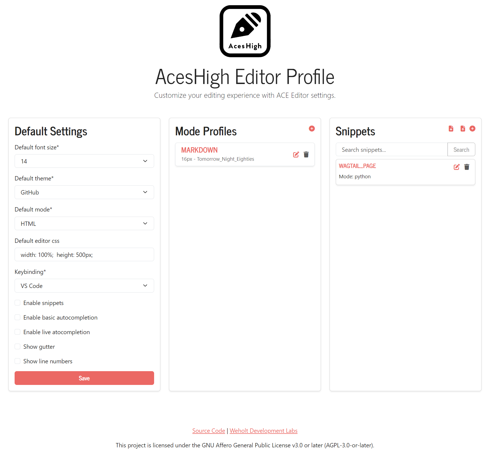

# AcesHigh


AcesHigh is a Django application designed to integrate the ACE editor into Django forms seamlessly.

## Features
- Customizable ACE editor settings
- Support for multiple ACE editor themes and modes
- Snippet management with tagging support
- Fullscreen editor toggle
- Snippet search
- Public snippet sharing with an API

## Requirements
- Python 3.12+
- Django 5.0+
- django-crispy-forms
- django-crispy-bootstrap5
- django-taggit
- djangorestframework

For use in Wagtail you'll of course have to install Wagtail as well.

## Version
Current version is 0.1.0 and considered pre-alpha.

## Screenshots

### Django 

You can define default settings for ACE Editors, like font-size, theme & custom CSS.


You can define snippets with fancy autocomplete for faster coding.


You can specify specific theme, font-size and css per mode.

### Wagtail

You can use the editor as a model field in Wagtail as well.


There is three icons above each editor:
1) Click here to see an info panel about the editor; what mode it's using, the theme etc.

2) Clicking on the gear icon will take you to the edit page of the editor mode profile
3) Clicking on the expanding arrows enter fullscreen mode.

## API


## Installation
1. Install the package:
    ```bash
    pip install git+https://github.com/weholt/aceshigh.git
    ```

2. Add `aceshigh` and its dependencies to your `INSTALLED_APPS` in `settings.py`:
    ```python
    INSTALLED_APPS = [
        ...
        'crispy_forms',
        'crispy_bootstrap5',
        'taggit',
        'rest_framework',
        'aceshigh',
    ]

    CRISPY_ALLOWED_TEMPLATE_PACKS = "bootstrap5"
    CRISPY_TEMPLATE_PACK = "bootstrap5"
    ```

3. Include the AcesHigh URLs in your `urls.py`:
    ```python
    from django.urls import include, path

    urlpatterns = [
        ...
        path('aceshigh/', include('aceshigh.urls')),
    ]
    ```

## License
This project is licensed under the GNU Affero General Public License v3.0 or later (AGPL-3.0-or-later).

## Credits
- [ACE Editor](https://github.com/ajaxorg/ace)
- [Wagtail ACE Editor](https://github.com/Nigel2392/wagtail_ace_editor) for inspiration.
- [django-ace](https://github.com/fdemmer/django-ace) for inspiration.
- [django-ace (fork)](https://github.com/django-ace/django-ace) for inspiration.

Besides the ACE editor project itself, no code was used (so far) from any of the other projects.

## Known bugs, limitations and planned features
- BUG: Going fullscreen makes the snippets appear behind the editor
- BUG: Keybinding does not work yet.
- Missing feature: Wagtail streamfield is not working, but coming soon.
- Missing feature: custom fonts

## Usage Examples

### Example 1: Using the Custom Field in a Model

Define a model using the custom `AceEditorField`:

```python
# filename: models.py

from django.db import models
from .fields import AceEditorField

class YourModel(models.Model):
    content = AceEditorField()
```

### Example 2: Using the custom field in Wagtail

```python
from wagtail.models import Page
from wagtail.admin.panels import FieldPanel
from aceshigh.fields import AceEditorField


class HomePage(Page):
    content = AceEditorField(mode='html', null=True, blank=True)
    css_content = AceEditorField(mode='css', null=True, blank=True)
    js_content = AceEditorField(mode='javascript', null=True, blank=True)
    python_content = AceEditorField(mode='python', null=True, blank=True)
    markdown_content = AceEditorField(mode='markdown', null=True, blank=True)

    content_panels = Page.content_panels + [
        FieldPanel('content'),
        FieldPanel('css_content'),
        FieldPanel('js_content'),
        FieldPanel('python_content'),
        FieldPanel('markdown_content'),
    ]    
```
